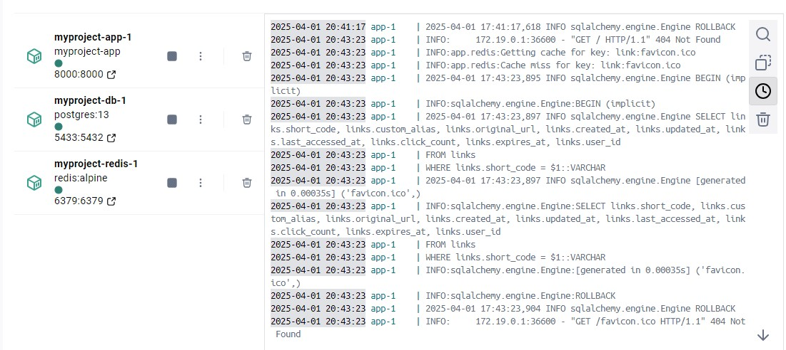
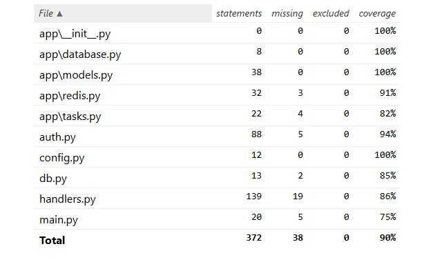

# Short Links API

## Описание
Это приложение предоставляет API для создания, получения, обновления и удаления коротких ссылок, а также для отслеживания статистики и поиска ссылок по оригинальному URL.

## Функции

### Обязательные функции

1. **Создание короткой ссылки**:
   - **Метод**: `POST /links/shorten`
   - **Описание**: Создает короткую ссылку для предоставленного оригинального URL. Поддерживает опциональный параметр для указания кастомного alias.
   - **Параметры**:
     - `original_url` (обязательный): Оригинальный URL для сокращения.
     - `custom_alias` (опциональный): Кастомный alias для короткой ссылки.
     - `expires_at` (опциональный): Время истечения жизни ссылки (в формате даты с точностью до минуты).
   - **Ответ**:
     ```json
     {
       "short_url": "http://localhost:8000/{short_code}"
     }
     ```

2. **Перенаправление по короткой ссылке**:
   - **Метод**: `GET /links/{short_code}`
   - **Описание**: Перенаправляет на оригинальный URL, связанный с коротким кодом.
   - **Ответ**: Перенаправление на оригинальный URL.

3. **Удаление короткой ссылки**:
   - **Метод**: `DELETE /links/{short_code}`
   - **Описание**: Удаляет короткую ссылку по короткому коду. Доступно только для зарегистрированных пользователей.
   - **Ответ**:
     ```json
     {
       "message": "Short link deleted successfully"
     }
     ```

4. **Обновление короткой ссылки**:
   - **Метод**: `PUT /links/{short_code}`
   - **Описание**: Обновляет alias для существующей короткой ссылки. Доступно только для зарегистрированных пользователей.
   - **Ответ**:
     ```json
     {
       "message": "Short link updated successfully",
       "new_short_url": "http://localhost:8000/{new_short_code}",
       "original_url": "{original_url}",
       "custom_alias": "{new_custom_alias}",
       "expires_at": "{new_expires_at}"
     }
     ```

5. **Статистика по короткой ссылке**:
   - **Метод**: `GET /links/{short_code}/stats`
   - **Описание**: Отображает статистику о короткой ссылке. 
   - **Ответ**:
     ```json
     {
       "original_url": "{original_url}",
       "created_at": "{created_at}",
       "click_count": "{click_count}",
       "last_accessed_at": "{last_accessed_at}"
     }
     ```

6. **Поиск ссылки по оригинальному URL**:
   - **Метод**: `GET /links/search`
   - **Описание**: Позволяет искать короткие ссылки по оригинальному URL. Доступно только для зарегистрированных пользователей.
   - **Ответ**:
     ```json
     [
       {
         "short_code": "{short_code}",
         "original_url": "{original_url}",
         "expires_at": "{expires_at}",
         "created_at": "{created_at}"
       }
     ]
     ```

### Дополнительные функции

1. **Отображение истории всех истекших ссылок**:
   - Позволяет просматривать ссылки, срок действия которых истек.

2. **Создание коротких ссылок для незарегистрированных пользователей**:
   - Позволяет создавать короткие ссылки без обязательной регистрации, но с ограниченным функционалом.

### Регистрация и авторизация

Регистрация пользователей осуществляется через систему OAuth2. Изменение и удаление ссылок доступно только для авторизованных пользователей. Для регистрации и получения токена используйте эндпоинт для авторизации.

## Технологии

- **FastAPI** — основной фреймворк для создания API.
- **PostgreSQL** — база данных для хранения ссылок.
- **Redis** — используется для кэширования популярных ссылок и статистики.
- **OAuth2** — для аутентификации и авторизации пользователей.
- **Alembic** — инструмент для управления миграциями базы данных SQLAlchemy.

## Инструкция по запуску
1. Клонирование репозитория
```git init
git remote add origin git@github.com:<your_nickname>/<repo_name>.git
.... add gitignore
git add .
git commit -m "..."
git branch -M main
git push -u origin main
```

2. Запуск с помощью Docker Compose
```
docker-compose up --build
```


## Описание базы данных 

Эти таблицы обеспечивают хранение основной информации о пользователях, созданных ссылках и их истории, позволяя реализовать функции создания, обновления, удаления и получения статистики по коротким ссылкам.

### Таблица `users`

Содержит информацию о зарегистрированных пользователях.

- **id**: UUID  
  Уникальный идентификатор пользователя, генерируется с помощью `uuid.uuid4`.
- **email**: String(255)  
  Электронная почта пользователя. Обязательное поле, должно быть уникальным.
- **hashed_password**: String  
  Хэшированный пароль пользователя. Обязательное поле.

---

### Таблица `links`

Хранит данные о созданных коротких ссылках.

- **short_code**: String(10)  
  Основной ключ таблицы, уникальный идентификатор короткой ссылки. Используется для перенаправления.
- **custom_alias**: String (опционально)  
  Пользовательский alias для короткой ссылки. Может быть задан при создании.
- **original_url**: String  
  Оригинальный URL, который необходимо сократить. Обязательное поле.
- **created_at**: DateTime  
  Дата и время создания ссылки. По умолчанию устанавливается текущее время (UTC, без таймзоны).
- **updated_at**: DateTime  
  Дата и время последнего обновления ссылки. Автоматически обновляется при изменениях.
- **last_accessed_at**: DateTime  
  Дата и время последнего перехода по ссылке.
- **click_count**: Integer  
  Количество переходов по ссылке.
- **expires_at**: DateTime  
  Дата и время истечения срока действия ссылки. По умолчанию устанавливается 30 дней от даты создания, если не задано иное.
- **user_id**: UUID (опционально)  
  Внешний ключ, связывающий ссылку с таблицей `users`. Может быть `null` для незарегистрированных пользователей.

---

### Таблица `link_history`

Содержит историю использования ссылок (например, для устаревших или удалённых ссылок).

- **id**: UUID  
  Уникальный идентификатор записи в истории, генерируется с помощью `uuid.uuid4`.
- **short_code**: String(10)  
  Короткий код, соответствующий ссылке.
- **original_url**: String  
  Оригинальный URL, связанный с короткой ссылкой.
- **expires_at**: DateTime  
  Дата и время, когда ссылка истекла.
- **click_count**: Integer  
  Количество переходов, зафиксированных для данной ссылки.
- **created_at**: DateTime  
  Дата и время создания записи в истории.
- **user_id**: UUID (опционально)  
  Внешний ключ, связывающий запись с пользователем из таблицы `users`.

# Тестирование API-сервиса

## Покрытие тестами:
Покрытие кода тестами составляет **90%**.



## Нагрузочное тестирование:
В ходе тестирования производительности системы с использованием Locust, была проверена эффективность работы ключевых эндпоинтов API, таких как создание коротких ссылок и их перенаправление.

Конфигурация нагрузки:
- **Количество пользователей**: 300
- **Запросов в секунду**: 30
- **Время ожидания между запросами**: от 1 до 3 секунд.
- **Объем тестируемых задач**:
  - **60%** - создание коротких ссылок (`createShortLink`).
  - **40%** - редирект по коротким ссылкам (`redirectToOriginalUrl`).
  
_1743529504.025.png)

## Запуск юнит и функциональных тестов с pytest:
Для запуска всех тестов выполните команду:
```
set PYTHONPATH=. && pytest tests/
```

## Запуск нагрузочного тестирования с locust
Запуск сервера
```
python -m uvicorn main:app --host 0.0.0.0 --port 8000
```
Запуск Locust
```
python -m locust --locustfile=tests/load_tests/locustfile.py
```
